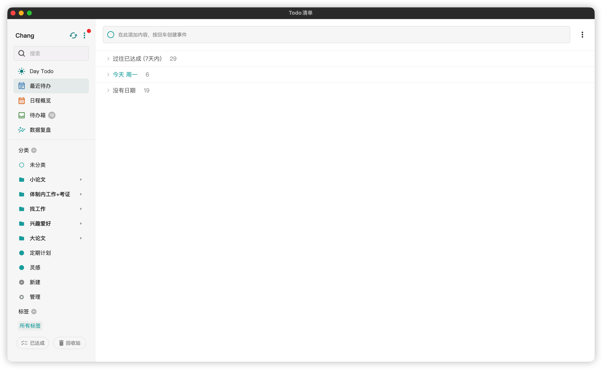

# DaySpark / 灵光

**灵光一闪，日程了然。**

An open-source, AI-powered calendar and todo app. Built with Flutter, runs everywhere.



## Features

- **Calendar** — Month/week/day views with event creation and recurring events (RRULE)
- **Todos** — Priority levels, due dates, completion tracking, recurring tasks
- **CalDAV Sync** — Two-way sync with any CalDAV server (Radicale, Nextcloud, etc.)
- **AI Assistant** — Natural language event/todo creation via OpenAI-compatible API
- **Tags** — Organize events and todos with colored tags
- **Reminders** — Automatic notifications before events and due dates
- **Search** — Full-text search across events and todos
- **ICS Import/Export** — Calendar data interchange
- **MCP Server** — Expose calendar/todo data to AI agents via localhost HTTP endpoint (desktop only)
- **i18n** — English and 中文 (contribution welcome for more languages)
- **Offline-first** — All data stored locally in SQLite via Drift
- **Cross-platform** — Web, macOS, iOS, Android, Windows, Linux

## Tech Stack

- **Flutter** + Dart
- **Drift** (SQLite ORM) for local database
- **Riverpod** for state management
- **go_router** for navigation
- **kalender** for calendar UI
- **Dio** for HTTP (CalDAV client)

## Getting Started

### Prerequisites

- Flutter SDK >= 3.11.0
- For macOS/iOS: Xcode + CocoaPods
- For Android: Android SDK
- For web: Chrome

### Install & Run

```bash
flutter pub get
dart run build_runner build
flutter run -d chrome    # Web
flutter run -d macos     # macOS
flutter test             # Run tests
```

### Build

```bash
flutter build web     # Web
flutter build macos   # macOS
flutter build apk     # Android
flutter build ios     # iOS
```

## Configuration

### CalDAV
Settings → CalDAV Account → enter server URL, username, password.

### AI
Settings → AI Configuration → enter API key, base URL, model name. Works with any OpenAI-compatible API.

## Documentation

- [Design System](DESIGN.md) — UI/UX specifications
- [Project Plan](docs/PLAN.md) — Feature status and roadmap
- [Requirements](docs/REQUIREMENTS.md) — Full feature requirements
- [CalDAV Sync Plan](docs/caldav-sync-plan.md) — Synchronization architecture

## Contributing

Issues and pull requests are welcome. This project follows the design principles in [DESIGN.md](DESIGN.md).

## License

[GPLv3](LICENSE)
